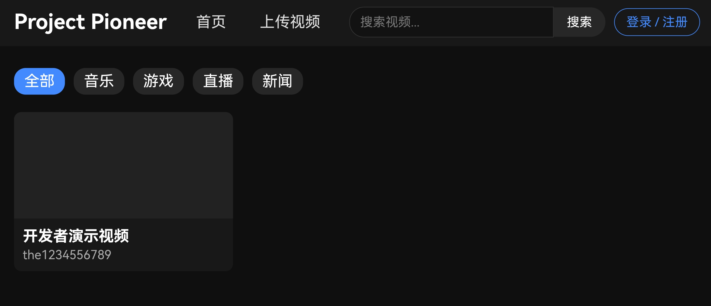

# Project Pioneer
仿YouTube网页视频平台

🌐 **在线站点**：https://the1234556789.github.io/project-pioneer/

## 📌 简介
Project Pioneer 是一款复刻YouTube电脑端布局的网页视频平台。
采用经典左右双栏电脑端布局，内置视频播放器、评论模块，后续支持拓展多语言。
本项目为独立视频网站，与我的世界启动器无任何关联。

## 📦 Windows 桌面客户端
最新版本：v3.20.1
[前往 Releases 下载](https://github.com/the1234556789/project-pioneer/releases/tag/v3.20.1)

### 运行要求
网页版
任意现代浏览器（Chrome、Edge）

桌面客户端（Electron）
- Windows 7 SP1 / Windows 10 / Windows 11
- 内存 ≥ 2GB

## ⚙️ 客户端信息
1. 安装程序支持 简体中文 / English 两种安装语言
2. 升级建议：安装新版本前卸载旧版本

## ⚠️ 声明
本项目仅为前端界面技术演示，仅供学习交流。

## 📄 版权
Copyright © 2024-2026 会泽工作室 All Rights Reserved

---

# English
# Project Pioneer
YouTube-style web video platform

🌐 **Online Website**: https://the1234556789.github.io/project-pioneer/

## Introduction
Project Pioneer is a web video platform replicating the PC layout of YouTube.
It adopts the classic two-column layout for PC, built-in video player and comment system.
Multi-language support will be added in future updates.
This is an independent video platform, not related to Minecraft launcher.

## 📦 Windows Desktop Client
Latest Version: v3.20.1
[Download from Releases](https://github.com/the1234556789/project-pioneer/releases/tag/v3.20.1)

### Requirements
Web Version
Any modern browser (Chrome, Edge)

Electron Desktop Client
- Windows 7 SP1 / Windows 10 / Windows 11
- RAM ≥ 2GB

## Client Info
1. The installer supports Simplified Chinese and English.
2. Please uninstall old versions before upgrading.
3. "Huize Studio" is a virtual name for display only.

## Disclaimer
This project is only a front-end technical demo for learning purposes.

## Copyright
Copyright © 2024-2026 Huize Studio All Rights Reserved
